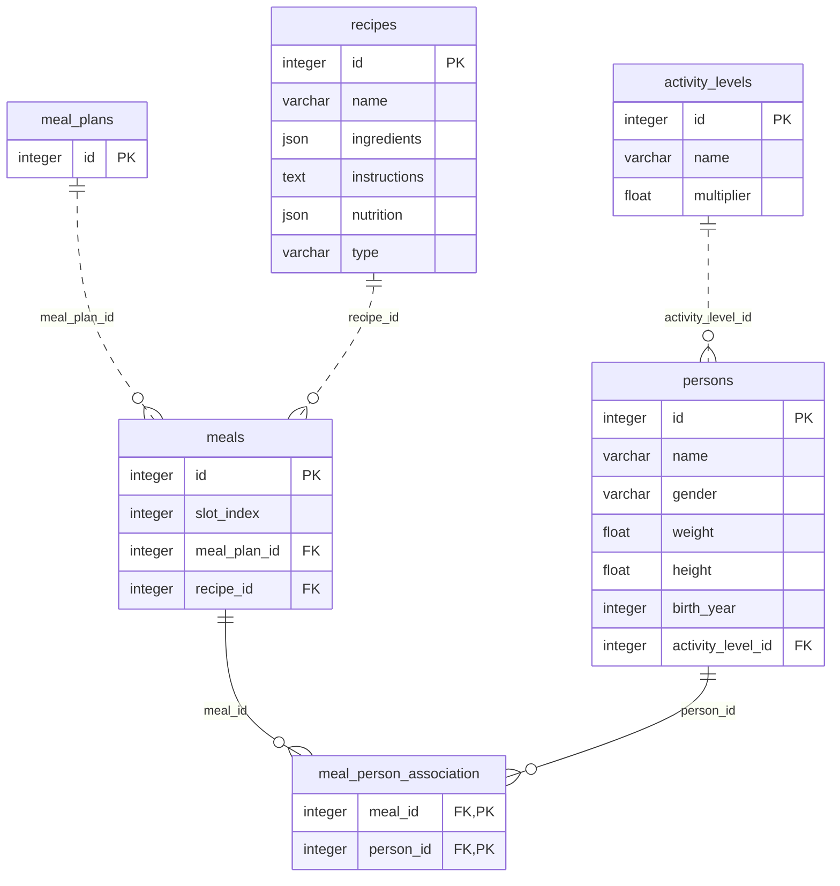

# Datamodel And Persistence

| Name   | Value      |
| :----- | :--------- |
| Status | ~Published |
| Owner  | @iBrotNano |

## Motivation

Developers who want to know about the data model of the app will find the needed information here.

## Datamodel

The app stores persons, recipes, meals and meal plans. Persons are persons in a household and used to calculate the needed nutrition. Recipes are containers for food and are used in meal plans to calculate the nutrition for meals. A meal plan ist a collection for meals for a household.



## Adding new entities

If you need to add a new entity class to store data into the database it must be registered to ensure they are known by sqlalchemy. It can be registered in `persistence/model_registry.py`.

```py
def load_model_definitions():
    """
    Imports ORM model modules so SQLAlchemy metadata knows all table mappings.

    :raises ModuleNotFoundError: If a model module cannot be imported.
    """
    import_module("persistence.schema")
    import_module("meal_plan.meal_plan_entity")
    import_module("meal_plan.meal_entity")
	...
```

## Unity Of Work

All data access logic is encapsulated in a `unit_of_work.py`. It initializes the database session and all repositories. It handles commits, rollbacks when failures happens and frees resources like the session.

It can be used with `with`.

```py
with UnitOfWork() as uow:
    self._meal_plan = uow.meal_plans.get() or MealPlan()
```