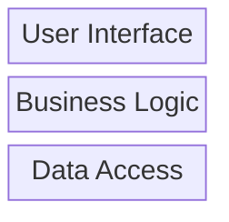

# :dart: Requirements <ID>

> [!NOTE] ISSUE
> Issue: [#37](https://github.com/iBrotNano/python_workshop_project/issues/37)

## :triangular_ruler: Design

I will use `sqlalchemy` as the ORM for the database access. The `sqlalchemy` library is a widely used and well-documented ORM that provides a high-level interface for working with databases in Python. It supports multiple database backends, including PostgreSQL, MySQL, SQLite, and more. This will allows me to change the database later more easily if needed. Additionally, `sqlalchemy` provides a powerful query language and supports features such as connection pooling, transactions, and migrations, which will be beneficial for the development and maintenance of the application.

I will store the database into a SQLite database. For now I don't need the scalability of a more powerful database. The app is only used locally at the moment and not designed to be used as a multi instance service. If the need arises to use a more powerful database, I can easily switch to a different database backend supported by `sqlalchemy` without having to change the code that interacts with the database.

I will configure the database connection in a configurator class and run it like the other ones. The datamodel is designed in entity classes. BL models need to be mapped to them during storage and retrieved data needs to be mapped back to BL models. This way the database access is decoupled from the rest of the application and can be easily changed if needed. The repository pattern is used to abstract the database access and provide a clean interface for the rest of the application to interact with the database. This will allow me to easily swap out the database implementation if needed without affecting the rest of the application. The repositories will be map BL models to the database entities and vice versa, so that the rest of the application can work with the BL models without having to worry about the underlying database implementation.

The BL models are implemented as dataclasses. This allows for a clean and simple way to define the data structures used in the business logic layer. The dataclasses provide a convenient way to define the fields and their types, and also provide built-in methods for common operations such as initialization, representation, and comparison. This will make it easier to work with the BL models and reduce boilerplate code.

The entities are implemented as SQLAlchemy models. This allows for a clean and simple way to define the database schema and interact with the database. The SQLAlchemy models provide a convenient way to define the fields and their types, and also provide built-in methods for common operations such as querying, inserting, updating, and deleting records in the database. This will make it easier to work with the database and reduce boilerplate code.

The mapping will work something like this:

```python
# Entity → Model
def entity_to_model(entity: UserEntity) -> User:
    return User(**entity.__dict__)


# Model → Entity
def model_to_entity(model: User) -> UserEntity:
    return UserEntity(**model.__dict__)
```

The API of the repositories will be stable to the API of the already implemented YAML storage. After all repositories are migrated the rest of the YAML code can be removed.

- `yaml_file_repository.py`
- Storage paths in `configuration.py`

The application will have a 3 layer model like this:



## :microscope: Dissection

| Integration test | ID                                          |
| ---------------- | ------------------------------------------- |
| Action           | What has to be done to validate the system? |
| Expected result  | What is a valid result?                     |


| Integration test | 1.1                                                                                          |
| ---------------- | -------------------------------------------------------------------------------------------- |
| Action           | I will add a person.                                                                         |
| Expected result  | The person is added successfully and stored into the database. It is stored in the database. |


| Integration test | 1.2                                                     |
| ---------------- | ------------------------------------------------------- |
| Action           | I will view a person.                                   |
| Expected result  | The person is displayed successfully from the database. |


| Integration test | 1.3                                                                                                                            |
| ---------------- | ------------------------------------------------------------------------------------------------------------------------------ |
| Action           | I will delete a person.                                                                                                        |
| Expected result  | The person is deleted successfully from the database. It is not accessable from the UI and not stored in the database anymore. |


| Integration test | 2.1                                                            |
| ---------------- | -------------------------------------------------------------- |
| Action           | I will add a recipe.                                           |
| Expected result  | The recipe is added successfully and stored into the database. |


| Integration test | 2.2                                                     |
| ---------------- | ------------------------------------------------------- |
| Action           | I will view a recipe.                                   |
| Expected result  | The recipe is displayed successfully from the database. |


| Integration test | 2.3                                                                                                                            |
| ---------------- | ------------------------------------------------------------------------------------------------------------------------------ |
| Action           | I will delete a recipe.                                                                                                        |
| Expected result  | The recipe is deleted successfully from the database. It is not accessable from the UI and not stored in the database anymore. |


## :hammer_and_wrench: Development

### :clipboard: TODOs

- [x] Update the dependencies
- [x] ~~Document the updated dependencies in CHANGELOG.md~~
- [x] Install `sqlalchemy`
- [x] Update requirements.txt
- [x] Configuration for the database connection in `configuration.py`
- [x] Refactor the OpenFoodFactsApiConfigurator into a builder and use it
- [x] Configurator for the database connection
- [x] Implement the database entities
  - [x] `person.py`
  - [x] `recipe.py`
- [x] Refactor into to files.
- [x] Repositories for the database access
  - [x] PersonRepository
  - [x] RecipeRepository
- [x] Mappers for the entities and BL models
  - [x] Person and PersonEntity
  - [x] Recipe and RecipeEntity
- [x] Entering names must be have max length of 100
- [x] Entering recipe names must be have max length of 255
- [x] The script to generate test data must be updated to generate data into the database instead of YAML files.
- [x] Rename builders into factories
- [x] "Do you want to save the recipe 'Skyr' to disk? (Y/n)" must be renamed.
- [ ] Change activity level into table and remove the hardcoded mapping.
- [ ] Check if the exception handling is well done
- [ ] Check if further tests must be written
- [ ] Are there license conflicts for new dependencies?
- [ ] Remove deactivated code
- [ ] Are all TODOs in the code done?
- [ ] Write meaningful comments
- [ ] Are there any compiler warnings?
- [ ] Do all unit tests pass?
- [ ] Format the code
- [ ] Is the version number correctly configured?
- [ ] Phrase a meaningful commit comment
- [ ] Check-in the changes and push them to the server
- [ ] Does the build on the buildserver succeed?
- [ ] Create a PR

### :eyes: Review

- [ ] Initialize dev environment
- [ ] Checkout the version from Git
- [ ] Can the application be compiled?
- [ ] Are there any open warnings?
- [ ] Does the application work as a manually performed test?
- [ ] Is the layout and theme working in the UI?
- [ ] Is the UI translated?
- [ ] Is every input validated in frontend and backend?
- [ ] Are the requirements and acceptance criteria met?
- [ ] Is the code correct, clean, maintainable and well structured?
- [ ] Is the code well tested?
  - [ ] Does the test name describe the context and goal from a business perspective? What is being specified, not how it is technically implemented.
  - [ ] One aspect per test?
  - [ ] One essential assert per test. Asserts for the context should be marked as such.
  - [ ] Side-effect free and complete? No shared **instances** of objects. Especially the SUT.
  - [ ] Only fixed input data?
  - [ ] Only own code is tested?
  - [ ] Does each component have a test suite?
- [ ] Must something in README.md be updated or described?
- [ ] Does the pipeline work?
- [ ] Are there new database migrations before merging to `main`? This ensures that the database will be in the correct state after deployment.
- [ ] Shut down the dev environment

### :spiral_notepad: Notes

Notes about the development of the issue.

## :mag: Debug

- [ ] ID: 🟢🔴🟡 Result: As Expected

## :books: Documentation

- [ ] Do I need a new PIA or update an existing one?
- [ ] Update the README.md
  - [ ] Document the usage of the model registry and how to add new entities.
- [ ] Update the CHANGELOG.md
- [ ] Describe the setup of the story if needed for end users
- [ ] Does something in the wiki needed to be updated?
- [ ] Needs other stuff been documented?

### :bulb: Decisions

| Decision          | Cause                      |
| ----------------- | -------------------------- |
| What was decided? | Why was the decision made? |

### :page_facing_up: PIAs

Link to related PIA

### :link: Links

- Any other documentation should be linked here. Intern and extern.

## :unicorn: Magie

Hints and tricks that were helpful during the implementation or documentation.

<details>
    <summary>Emojis to label information</summary>

| Emoji                | Bedeutung                 |
| :------------------- | :------------------------ |
| :x:                  | Nein                      |
| :ok:                 | Ja                        |
| :warning:            | Achtung                   |
| :information_source: | Zusätzliche Informationen |
| :zzz:                | Wartet                    |
| :red_circle:         | Fehlschlag                |
| :green_circle:       | Erfolg                    |
| :yellow_circle:      | Problem                   |
</details>

<details>
    <summary>Notification panels</summary>

```markdown
> [!NOTE]
> This is a note

> [!TIP]
> This is a tip.

> [!WARNING]
> This is a warning

> [!IMPORTANT]
> This info is important to know.

> [!CAUTION]
> This has possibly negative consequences.
```
</details>

<details> 
    <summary>PR</summary>

A PR needs a title that lets the reviewer recognize which ticket it belongs to. The format is:

`#<issue number> <issue title>`

It helps the reviewer if you provide details about the development environment. Breaking changes in services can make it unclear which versions of services the reviewer should use for the review.

The versions can be set up from artefacts or via Git by using the correct branches.

If the exact version is not critical, it may be sufficient to simply use the image with latest.

Here is a template for a PR:

```markdown

## Notes

BREAKING CHANGE: Is this a breaking change?

Is there anything special to note? Perhaps deviations from the ticket or details that came up during development?

## Changes

- Fixed a typo
- Optimized code
- New feature XYZ

## Development environment

### Versions

| Application | Version |
| :---------- | ------: |
| Client      |   1.5.0 |
| Service     |   1.2.4 |
| KeyCloak    |  latest |
| Postgres    |  latest |

### Setup

Scripts or test data used? Ideally attach or link it.
```
</details>