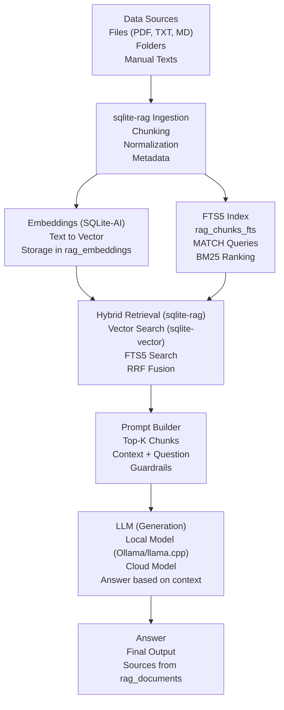

# :dart: Requirements #53

> [!NOTE]
> Issue: [#53](https://github.com/iBrotNano/python_workshop_project/issues/53)

## :triangular_ruler: Design

### Persistence

Users can search for food and recipes. By selecting food from the results they see a nice view with all relevant data and a link to the original source of the data. In the recipe functionality the food is added to the recipe. In this feature not only the raw data should be presented but also insights about the search result and healthier alternatives.

The user has search functionality to search for food products and raw ingredients. This search uses the OpenFoodFacts-API at the moment. Because this API is instable and slow and has no data about raw ingredients an own database will be hosted. I already have a project loading the data and storing them in a Postgres database. For now i use a SQLite database because the app will only run locally at the moment and already uses one. The app uses **sqlalchemy** for [data access logic](../articles/persistence.md). To change the database later might be possible if more scalability is needed. SQLite keeps the complexity from running another database server as part of the system out. The RAG-System will not be portable to Postgres as easy as the data storage itself. This part of the system must be strongly encapsulated and used by the rest of the system by a well defined API.

The chatbot will be part of a [RAG](https://de.wikipedia.org/wiki/Retrieval-Augmented_Generation). RAGs uses own data LLMs does not know to enrich LLM answers. That means it needs to find the all data useful to sharpen it's answer. This means it has to search for the data semantically. Storing the data in a vector database is the usual way to solve this problem. First the data must be prepared and chop into chunks that can be stored into as a vector. A chunk size of 200 - 400 tokens is an optimum. Textual data to be chunked is:

- brands
- name
- synonyms
- categories

To chunk the data it must be read from database and formatted into a plain text snippet.

```
name: Redwood Coast Sriracha & Monterey Jack Cheese
brand: Redwood Coast
type: Sriracha Jack
categories: Dairies; Fermented foods; Fermented milk products; Cheeses
attributes: spicy; dairy; fermented
```

Beside the textual data there are is numerical data like calories, protein, fat ect. They are also added to the text chunk as key value pairs as not normalized data. This helps to find semantically near products.

> Find me a product with a lot of protein and less sugar.

```
name: Redwood Coast Sriracha & Monterey Jack Cheese
brand: Redwood Coast
type: Sriracha Jack
categories: Dairies; Fermented foods; Fermented milk products; Cheeses
attributes: spicy; dairy; fermented
calories_per_100g: 210
fat_g: 18
protein_g: 12
carbs_g: 3
```

Beside the textual chunk the numerical data is stored normalized into a second vector. This helps to calculate a score.

$$
norm = (x - mean) / std
$$

Both vectors will be part of rankings. 

#### Example: Hybrid‑Ranking in SQL

Here is the full translation of your text into **clear, precise English**, preserving the technical meaning:

##### **1. Semantic similarity (cosine distance)** 

```
semantic_score := 1 - (embedding_semantic <=> query_embedding)
```

##### **2. Numerical similarity (L2 or cosine)**  

```
numeric_score := 1 - (embedding_numeric <-> query_numeric)
```

##### **3. Combined ranking**  

You weight both scores:

```sql
SELECT
    id,
    0.8 * (1 - (embedding_semantic <=> :query_semantic)) +
    0.2 * (1 - (embedding_numeric <-> :query_numeric)) AS hybrid_score
FROM products
ORDER BY hybrid_score DESC
LIMIT 20;
```

##### **Why 0.8 / 0.2?**  

- **80% semantic relevance**  
- **20% numerical similarity**

Additionally to the vector the IDs of the data in a relational database will be stored as metadata. This way the real data of founded vectors can be loaded and used to create the prompt for the LLM.

##### FTS5

To further make the findings more relevant the semantic search is combined with [SQLite FTS5 Extension](https://sqlite.org/fts5.html) for keyword searching. 

FTS5 is excellent for **keyword‑based search**, while embeddings enable **semantic search**.

In modern RAG systems you often combine:

- **FTS5 →** exact matches and fast filtering  
- **Embeddings →** semantic similarity  
- **RRF (Reciprocal Rank Fusion) →** merges both rankings  

This creates a **hybrid search** that performs significantly better than using only embeddings or only FTS.

[sqliteai/sqlite-rag: A hybrid search engine built on SQLite with SQLite AI and SQLite Vector extensions](https://github.com/sqliteai/sqlite-rag) is an extension which implements a whole RAG pipeline in a SQLite database.

### Prompt

The prompt is a role based prompt containing the search result and informs the user about the pros and cons of the found products.

For the recipe search also a selectable list of the found products is shown. The user can select one to add it to the recipe.

For complete recipes a user can ask for alternatives to make the recipe more healthy. This means a search must be performed to find all alternatives for all ingredients. 

### LLM

The used LLM should be configurable to enable remote and locally run models. Run models must be compatible with OpenAI-Python-Libs API. This way only one implementation of the API must be implemented.

### RAG Pipeline




### Known Issues

RAGs must be modified continuously because they depend on external data structures and APIs.

## :microscope: Dissection

| Integration test | 1                                                                                      |
| ---------------- | -------------------------------------------------------------------------------------- |
| Action           | As a user I will search for a food product by describing it.                           |
| Expected result  | I will get a textual answer by an LLM and the selection to select one of the products. |


| Integration test | 2                                                                                                                                                                                                    |
| ---------------- | ---------------------------------------------------------------------------------------------------------------------------------------------------------------------------------------------------- |
| Action           | As a user I will search for a food product by describing it to add it to a recipe.                                                                                                                   |
| Expected result  | I will get a textual answer by an LLM and the selection to select one of the products which is added to the recipe. I will get further information about the recipe and the nutritional information. |

## :hammer_and_wrench: Development

### :clipboard: TODOs

- [ ] Update the dependencies
- [ ] Document the updated dependencies in CHANGELOG.md
- [ ] Use the logic from external project to get the external data from OpenFoodFacts and the Schweizer Ernährungsdatenbank and port it to this project to store them in the SQLite database
- [ ] Update method to update the nutritional information
- [ ] Integrate **sqlite-rag**
- [ ] Chunk all data and store them as vectors
- [ ] Search for food
- [ ] Load data for vector search results
- [ ] Create a prompt for nutritional search
- [ ] Additional add a list with the search results in the recipe functionality
- [ ] Search for all ingredients of a recipe and find more healthy alternatives. The LLM tells the user why they are more healthy.
- [ ] Check if the exception handling is well done
- [ ] Check if further tests must be written
- [ ] Are there license conflicts for new dependencies?
- [ ] Remove deactivated code
- [ ] Are all TODOs in the code done?
- [ ] Write meaningful comments
- [ ] Are there any compiler warnings?
- [ ] Do all unit tests pass?
- [ ] Format the code
- [ ] Is the version number correctly configured?
- [ ] Phrase a meaningful commit comment
- [ ] Check-in the changes and push them to the server
- [ ] Does the build on the buildserver succeed?
- [ ] Create a PR

### :eyes: Review

- [ ] Initialize dev environment
- [ ] Checkout the version from Git
- [ ] Can the application be compiled?
- [ ] Are there any open warnings?
- [ ] Does the application work as a manually performed test?
- [ ] Is the layout and theme working in the UI?
- [ ] Is the UI translated?
- [ ] Is every input validated in frontend and backend?
- [ ] Are the requirements and acceptance criteria met?
- [ ] Is the code correct, clean, maintainable and well structured?
- [ ] Check if the exception handling is well done
- [ ] Are there license conflicts for new dependencies?
- [ ] Is there any deactivated code?
- [ ] Are all TODOs in the code done?
- [ ] Are there enough meaningful comments?
- [ ] Is the code well tested?
  - [ ] Does the test name describe the context and goal from a business perspective? What is being specified, not how it is technically implemented.
  - [ ] One aspect per test?
  - [ ] One essential assert per test. Asserts for the context should be marked as such.
  - [ ] Side-effect free and complete? No shared **instances** of objects. Especially the SUT.
  - [ ] Only fixed input data?
  - [ ] Only own code is tested?
  - [ ] Does each component have a test suite?
- [ ] Must something in README.md be updated or described?
- [ ] Does the pipeline work?
- [ ] Are there new database migrations before merging to `main`? This ensures that the database will be in the correct state after deployment.
- [ ] Shut down the dev environment

### :spiral_notepad: Notes

Notes about the development of the issue.

## :mag: Debug

- [ ] ID: 🟢🔴🟡 Result: As Expected

## :books: Documentation

- [ ] Do I need a new PIA or update an existing one?
- [ ] Update the README.md
- [ ] Update the CHANGELOG.md
- [ ] Describe the setup of the story if needed for end users
- [ ] Does something in the wiki needed to be updated?
- [ ] Needs other stuff been documented?

### :bulb: Decisions

| Decision                                        | Cause                         |
| ----------------------------------------------- | ----------------------------- |
| The OpenFoodFacts-API will not be used anymore. | The API is slow and instable. |


| Decision                                                                       | Cause                                                                     |
| ------------------------------------------------------------------------------ | ------------------------------------------------------------------------- |
| Nutritional information is stored in the SQLite database used by this project. | Al data is stored in a single location and can be published with the app. |


| Decision                                                                                                                            | Cause                                            |
| ----------------------------------------------------------------------------------------------------------------------------------- | ------------------------------------------------ |
| A chatbot helps the user to make decisions about ingredients for recipes and answers questions about food products as a RAG system. | The RAG enriches LLMs answers about my own data. |


| Decision                                                                        | Cause                                                           |
| ------------------------------------------------------------------------------- | --------------------------------------------------------------- |
| I store the textual data and not normalized numerical data combined in a chunk. | All relevant data is used to find semantically equivalent food. |


| Decision                                                                                                                  | Cause           |
| ------------------------------------------------------------------------------------------------------------------------- | --------------- |
| I store numerical data normalized in a second vector and combine the semantic vector and the numeric vector for rankings. | Better ranking. |


| Decision                                                                        | Cause                                                                                |
| ------------------------------------------------------------------------------- | ------------------------------------------------------------------------------------ |
| Users can configure the used LLM as long as they are compatible to OpenAIs API. | Easy implementation. Broadly used standard for the API. A lot of models can be used. |


| Decision                                              | Cause                                                                                                                           |
| ----------------------------------------------------- | ------------------------------------------------------------------------------------------------------------------------------- |
| **sqlite-rag** is used to implement the RAG pipeline. | It already implements all from chunking to storing the embeddings and is the fastest way to implement a stable RAG with SQLite. |


### :page_facing_up: PIAs

Link to related PIA

### :link: Links

- [Retrieval-Augmented Generation – Wikipedia](https://de.wikipedia.org/wiki/Retrieval-Augmented_Generation)
- [SQLite FTS5 Extension](https://sqlite.org/fts5.html)
- [sqliteai/sqlite-rag: A hybrid search engine built on SQLite with SQLite AI and SQLite Vector extensions](https://github.com/sqliteai/sqlite-rag)

## :unicorn: Magie

Hints and tricks that were helpful during the implementation or documentation.

<details>
    <summary>Emojis to label information</summary>

| Emoji                | Bedeutung                 |
| :------------------- | :------------------------ |
| :x:                  | Nein                      |
| :ok:                 | Ja                        |
| :warning:            | Achtung                   |
| :information_source: | Zusätzliche Informationen |
| :zzz:                | Wartet                    |
| :red_circle:         | Fehlschlag                |
| :green_circle:       | Erfolg                    |
| :yellow_circle:      | Problem                   |
</details>

<details>
    <summary>Notification panels</summary>

```markdown
> [!NOTE]
> This is a note

> [!TIP]
> This is a tip.

> [!WARNING]
> This is a warning

> [!IMPORTANT]
> This info is important to know.

> [!CAUTION]
> This has possibly negative consequences.
```
</details>

<details> 
    <summary>PR</summary>

A PR needs a title that lets the reviewer recognize which ticket it belongs to. The format is:

`#<issue number> <issue title>`

It helps the reviewer if you provide details about the development environment. Breaking changes in services can make it unclear which versions of services the reviewer should use for the review.

The versions can be set up from artefacts or via Git by using the correct branches.

If the exact version is not critical, it may be sufficient to simply use the image with latest.

Here is a template for a PR:

```markdown

## Notes

BREAKING CHANGE: Is this a breaking change?

Is there anything special to note? Perhaps deviations from the ticket or details that came up during development?

## Changes

- Fixed a typo
- Optimized code
- New feature XYZ

## Development environment

### Versions

| Application | Version |
| :---------- | ------: |
| Client      |   1.5.0 |
| Service     |   1.2.4 |
| KeyCloak    |  latest |
| Postgres    |  latest |

### Setup

Scripts or test data used? Ideally attach or link it.
```
</details>